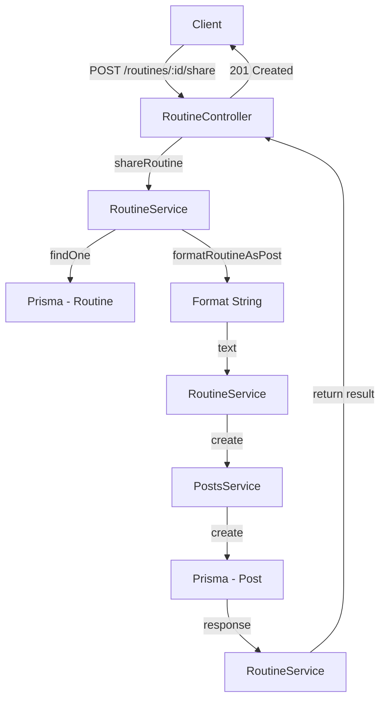

# Share Routine Feature - Backend Documentation

## 🚀 Overview

The Share Routine feature enables users to share their skincare routines as beautifully formatted social posts. This is a backend-driven feature that integrates with the existing Posts and Routines modules.

---

## 🏗️ Architecture

### Modules Involved

1. **Routines Module** - Creates routine content
2. **Posts Module** - Creates social posts
3. **Users Module** - Associated user information
4. **Notifications Module** - Optional: notify followers

### New Components

#### DTO: ShareRoutineDto

**File:** `src/routine/dto/share-routine.dto.ts`

```typescript
export class ShareRoutineDto {
  @IsUUID()
  routineId: string;

  @IsOptional()
  @IsString()
  @MaxLength(1000)
  customMessage?: string;

  @IsOptional()
  @IsString()
  coverImage?: string;
}
```

---

## 📡 API Endpoint

### POST /routines/:id/share

**Description:** Share an existing routine as a social post

**Authentication:** Required (Bearer JWT)

**Request Parameters:**
- `id` (URL param): Routine ID to share

**Request Body:**
```json
{
  "customMessage": "Check out my morning routine! 💕",
  "coverImage": "https://example.com/image.jpg"
}
```

**Response:**
```json
{
  "post": {
    "id": "uuid",
    "userId": "uuid",
    "message": "🌅 My Morning Routine\nAM • 7 étapes\n\n💬 \"Check out my morning routine! 💕\"\n\n📋 Routine:\n1. Nettoyage - CeraVe Hydrating Cleanser ⏱️ 1min\n...",
    "media": "image_url_or_null",
    "status": "published",
    "createdAt": "2026-03-26T10:00:00Z",
    "user": {
      "id": "uuid",
      "name": "User Name",
      "avatar": "avatar_url"
    },
    "_count": {
      "likes": 0,
      "comments": 0
    }
  },
  "routine": {
    "id": "uuid",
    "name": "My Morning Routine",
    "type": "AM",
    "steps": [...],
    "isAIGenerated": false,
    "isActive": true
  },
  "message": "Routine partagée avec succès!"
}
```

**Status Codes:**
- 201: Routine shared successfully
- 400: Invalid request data
- 401: Unauthorized (missing or invalid token)
- 404: Routine not found

---

## 🔧 Implementation Details

### RoutineController

**File:** `src/routine/routine.controller.ts`

New endpoint added:

```typescript
@Post(':id/share')
@ApiOperation({
  summary: 'Partager une routine',
  description: 'Partage une routine comme un post social',
})
@ApiParam({ name: 'id', description: 'ID de la routine' })
@ApiResponse({ status: 201, description: 'Routine partagée avec succès' })
@ApiResponse({ status: 400, description: 'Données invalides' })
@ApiResponse({ status: 404, description: 'Routine non trouvée' })
async shareRoutine(
  @Param('id') id: string,
  @CurrentUser('sub') userId: string,
  @Body() shareDto: ShareRoutineDto,
): Promise<any> {
  return this.routineService.shareAsPost(id, userId, shareDto);
}
```

### RoutineService

**File:** `src/routine/routine.service.ts`

#### New Method: shareAsPost()

```typescript
async shareAsPost(
  routineId: string,
  userId: string,
  shareDto: ShareRoutineDto,
): Promise<any> {
  // Verify routine exists and belongs to user
  const routine = await this.findOne(routineId, userId);

  // Format routine as an attractive post message
  const postMessage = this.formatRoutineAsPost(routine, shareDto.customMessage);

  // Create the post with the formatted routine
  const post = await this.postsService.create(userId, {
    message: postMessage,
    media: shareDto.coverImage,
  });

  this.logger.log(
    `Routine ${routineId} shared as post ${post.id} by user ${userId}`,
  );

  return {
    post,
    routine,
    message: 'Routine partagée avec succès!',
  };
}
```

#### New Method: formatRoutineAsPost()

Formats a routine into an attractive social post message:

```typescript
private formatRoutineAsPost(
  routine: Routine,
  customMessage?: string,
): string {
  // Returns formatted message with:
  // - Type emoji (🌅 AM, 🌙 PM, ⭐ Weekly)
  // - Routine name
  // - Step count
  // - Custom message (if provided)
  // - Steps summary (first 4 steps)
  // - Routine notes
  // - Hashtags
  // - Max 2000 chars (Post limit)
}
```

### Module Updates

**File:** `src/routine/routine.module.ts`

Added PostsModule import:

```typescript
@Module({
  imports: [
    PrismaModule,
    AnalysisModule,
    SkinProfileModule,
    NotificationModule,
    CrawlingModule,
    PostsModule, // NEW
  ],
  controllers: [RoutineController],
  providers: [RoutineService],
  exports: [RoutineService],
})
export class RoutineModule {}
```

---

## 🗄️ Database Integration

### Existing Models Used

1. **Routine** - Source routine data
2. **Post** - Destination for social post
3. **User** - Post creator information

No new database models required. Related data through existing relationships.

---

## ✨ Post Message Formatting

### Example Output

For an AM routine with custom message:

```
🌅 My Morning Routine
AM • 7 étapes

💬 "I use this every morning!"

📋 Routine:
1. Nettoyage - CeraVe Hydrating Cleanser ⏱️ 1min
2. Tonique - Paula's Choice 2% BHA ⏱️ 1min
3. Sérum - The Ordinary Niacinamide ⏱️ 1min
4. Contour des yeux - Eye cream ⏱️ 1min
... et 3 étape(s) de plus

📝 Notes: Perfect for combination skin

#SkincareRoutine #DeepSkyn #BeautyCare #RoutineBeauté
```

### Formatting Rules

1. Type emoji based on routine.type
2. Routine name as title
3. Type and step count info
4. Custom message (if provided)
5. Step summary (max 4 steps shown)
6. Remaining steps count
7. Routine notes (truncated to 150 chars)
8. Relevant hashtags
9. Total message limit: 1900 chars (< 2000 POST_MAX_LENGTH)

---

## 🔐 Security

### Access Control

- User can only share their own routines
- Verified via `findOne(routineId, userId)`
- Throws NotFoundException if routine doesn't belong to user

### Validation

- DTO validates all inputs
- routineId must be valid UUID
- customMessage max 1000 chars
- coverImage must be valid URL (optional)

### Error Handling

- Routine not found → 404 NotFoundException
- Invalid DTO data → 400 BadRequestException
- User mismatch → 404 NotFoundException
- API errors → 500 Internal Server Error

---

## 📊 Integration Flow



---

## 🛠️ Development Guide

### Adding Share Feature to Routine

1. **DTO already created** ✅
   - `src/routine/dto/share-routine.dto.ts`

2. **Controller endpoint** ✅
   - `src/routine/routine.controller.ts` - shareRoutine()

3. **Service implementation** ✅
   - `src/routine/routine.service.ts` - shareAsPost() and formatRoutineAsPost()

4. **Module updated** ✅
   - `src/routine/routine.module.ts` - imports PostsModule

### Testing the Endpoint

```bash
# Example cURL request
curl -X POST http://localhost:3000/routines/uuid/share \
  -H "Authorization: Bearer YOUR_JWT_TOKEN" \
  -H "Content-Type: application/json" \
  -d '{
    "customMessage": "Check out my routine!",
    "coverImage": "https://example.com/image.jpg"
  }'
```

### NestJS CLI Testing

```bash
# Start dev server
npm run start:dev

# Test endpoint (via Swagger or Postman)
# POST /routines/{id}/share
# Headers:
#   Authorization: Bearer {token}
#   Content-Type: application/json
# Body:
#   {
#     "customMessage": "Great routine!",
#     "coverImage": optional
#   }
```

---

## 📈 Analytics & Logging

### Logged Events

1. **Routine Share Event**
   ```
   Routine ${routineId} shared as post ${post.id} by user ${userId}
   ```

2. **Error Cases**
   - Routine not found
   - Unauthorized access
   - Database errors

### Metrics to Track

- Total routines shared
- Share-to-post conversion rate
- Most shared routine types (AM/PM/Weekly)
- Average reach per shared routine

---

## 🚀 Future Enhancements

1. **Analytics Dashboard**
   - Track shares, views, engagement
   - Popular routines ranking

2. **Routine Recommendations**
   - "Similar routines" feature
   - Share notifications to followers

3. **Advanced Formatting**
   - Include routine image/thumbnail
   - Add product links/QR codes to post

4. **Routine Collections**
   - Share multiple routines as a collection
   - Routine series sharing

5. **Notifications**
   - Notify followers when user shares routine
   - Engagement notifications on shared routines

---

## 🐛 Known Issues & Fixes

### Issue: Post message too long

**Solution:** Already handled with max length checks and truncation

### Issue: Routine not found

**Solution:** Uses existing `findOne()` which throws NotFoundException

### Issue: User not authorized

**Solution:** Uses existing ownership check in `findOne()`

---

## 📚 Related Files

- Backend: `src/routine/` directory
- Backend: `src/posts/posts.service.ts` (creates posts)
- Frontend: Mobile client components
- Database: Prisma schema (Routine & Post models)

---

## ✅ Checklist

- [x] DTO Created (share-routine.dto.ts)
- [x] Controller Endpoint Added (shareRoutine)
- [x] Service Methods Implemented (shareAsPost, formatRoutineAsPost)
- [x] Module Updated (imports PostsModule)
- [x] Error Handling Implemented
- [x] Documentation Written
- [x] Frontend Components Created
- [x] API Integration on Frontend
- [x] Styling and UI/UX Completed

---

For questions or issues, refer to:
- Swagger docs: `http://localhost:3000/api#/Routines`
- Frontend: `DeepSkynMobile/SHARE_ROUTINE_DOCUMENTATION.md`
- Integration guide: `DeepSkynMobile/SHARE_ROUTINE_INTEGRATION_GUIDE.md`
